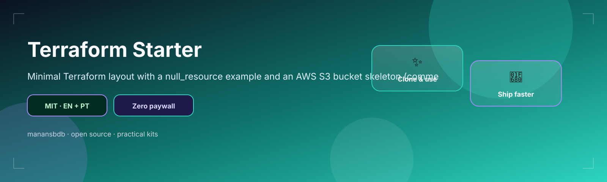

<p align="center">
  
</p>

<h1 align="center">terraform-starter</h1>

<p align="center">
  <strong>EN</strong> Minimal Terraform structure (null resource + AWS S3 example)<br/>
  <strong>PT</strong> Estrutura Terraform mínima (null resource + exemplo AWS S3)
</p>

<p align="center">
  <a href="https://github.com/manansbdb/terraform-starter/blob/main/LICENSE"></a>
  
  
  <a href="#support--apoio"></a>
</p>

---

## What it does / Para que serve

| English | Português |
|---------|-----------|
| A **minimal Terraform** layout (`versions`, `variables`, `main`, `outputs`) plus an AWS S3 example file. | Um layout **Terraform mínimo** (`versions`, `variables`, `main`, `outputs`) e um exemplo AWS S3. |
| Copy the root `.tf` files, run `terraform init` (free CLI), adapt providers carefully. | Copia os `.tf` da raiz, corre `terraform init` (CLI gratuita), adapta providers com cuidado. |


---

## Install / Instalação

### 1) Clone / Clona

```bash
git clone https://github.com/manansbdb/terraform-starter.git
cd terraform-starter
```

### 2) Init & explore / Init e explora

```bash
terraform init
terraform plan
# review carefully before any apply — cloud resources may incur cost on YOUR cloud account
```

### 3) Optional AWS example / Exemplo AWS opcional

```bash
# examples/aws-s3.tf.example is NOT applied by default — copy only if you need it
cp examples/aws-s3.tf.example aws-s3.tf
```

### Requirements / Requisitos

- `git`
- [Terraform CLI](https://developer.hashicorp.com/terraform/install) (free)
- **Cost note:** this repo itself is free; applying cloud resources uses *your* cloud billing — review plans before `apply`.

---

## Quick start / Início rápido

```bash
git clone https://github.com/manansbdb/terraform-starter.git
cd terraform-starter
terraform init && terraform plan
```

---

## Contents / Conteúdos

| Path | Purpose / Função |
|------|------------------|
| `versions.tf` | Terraform / provider versions |
| `variables.tf` | Input variables |
| `main.tf` | Resources (safe null demo) |
| `outputs.tf` | Outputs |
| `examples/aws-s3.tf.example` | Optional AWS example |
| `SUPPORT.md` | Donations / Doações |

---

## Project layout / Estrutura

```text
terraform-starter/
├── docs/banner.svg
├── versions.tf
├── variables.tf
├── main.tf
├── outputs.tf
├── examples/aws-s3.tf.example
├── SUPPORT.md
└── README.md
```

---

## Support / Apoio

Bitcoin donations welcome / Doações em Bitcoin bem-vindas:

```
bc1q0qfnlnxyum9u45stzxe0a7jnhtj4j0usfkqdjw
```

See [SUPPORT.md](./SUPPORT.md).

---

## License / Licença

[MIT](./LICENSE) © 2026 manansbdb
